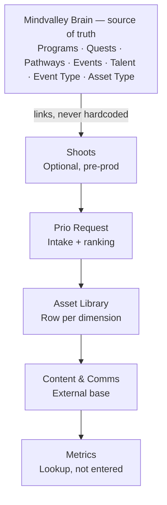
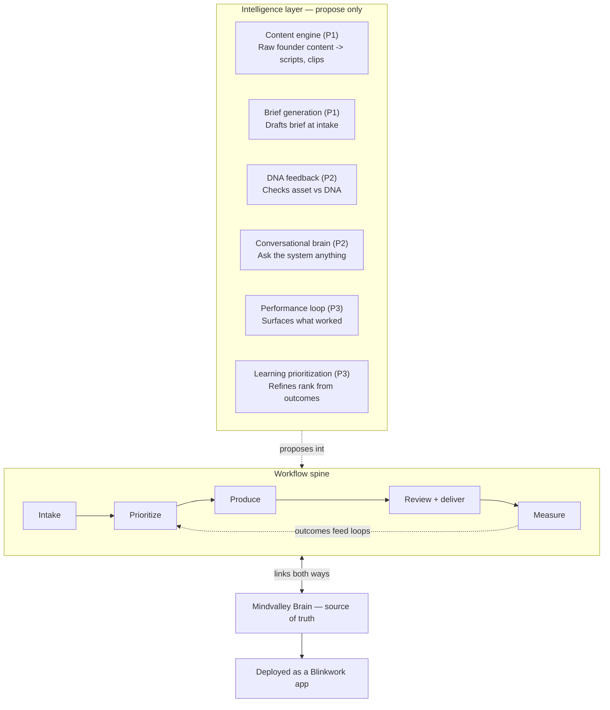
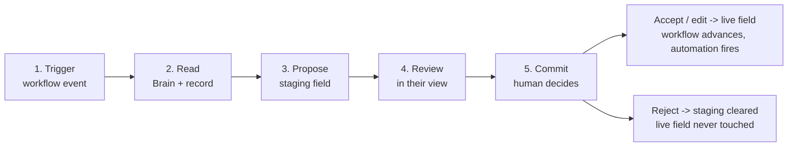

# CLAUDE.md — Creative Services Content System

> **Status:** Current as of 26 Jun 2026, post Films × Vishen meeting.
> **Owner:** Rhythm Malhotra · **Co-architect:** Moniek van Waaijenburg
> **This file is the single source of truth for the build.** It supersedes the
> original standalone `CLAUDE.md` + `schema.sql`. Where they conflict, this wins.

This document is the context layer for anyone (human or Claude Code) building,
extending, or writing a PRD for the Creative Services content production and
management system. It captures what is settled, what changed after Vishen, how
the AI interacts with the workflow, and what is still open.

---

## 0. One-paragraph summary

Mindvalley merged three creative divisions — Social, Ads, and Content — into one
Creative Services team. This system unifies their content production: a single
**request lifecycle** (intake → prioritize → produce → review/deliver → measure),
anchored to **Mindvalley Brain** as the source of truth, with an **intelligence
layer** of six **propose-only** AI capabilities above it. It ships as a
**Blinkwork app on the shared brain**, not a standalone tool. Airtable is the
editing surface and taxonomy connector; Brain is the system of record.

---

## 1. Architecture decision (the fork — now decided)

The original spec described a **standalone** build (Airtable → Postgres mirror).
That is **superseded**. The system is built as a **Blinkwork app on the shared
brain**:

| Concern | Standalone (old) | Blinkwork app (current) |
|---|---|---|
| System of record | Postgres mirror | **Brain** |
| Airtable | Source of truth | **Connector / editing surface** |
| Auth | App-built | **Platform identity** |
| API access | Direct calls | **Over MCP, server-side creds** |
| Intelligence | Bolted on | **Native on the shared brain** |
| Reusability | One-off | **Manifest other entities enable** |

What stays valid from the earlier work regardless of fork: the workflow
decisions, the prioritization algorithm, and all UI mockups. Those are the
product surface no matter where data lives.

**Vishen ratified this direction** on 26 Jun ("high-octane / AI-first"). The fork
is no longer open.

---

## 2. Non-negotiable principles

1. **Brain is the source of truth.** Anywhere a field references Programs,
   Quests, Pathways, Events, or Talent, it links to Brain — never hardcoded.
2. **Propose-only AI.** Every AI capability suggests into a staging field; a
   human commits. The AI never writes a live record directly. (See §6.)
3. **Event Type → Asset Type** are the two taxonomy building blocks. The form
   filters Asset Type by the chosen Event Type.
4. **Check live data before recommending.** Never theorize from schema alone;
   validate against live Airtable records (run `export-airtable-schema.js`
   first to resolve real field names and enums).
5. **Decisions from the three anchor meetings are settled.** Don't re-litigate;
   build from them. (Titus 1:1, Blinkwork Content Ops, Creative Prio Hackathon.)
6. **OODA-loop iteration.** Build to refine, not to perfect upfront.

---

## 3. The request lifecycle (the spine)

Every request travels one path:

```
Intake → Prioritize → Produce → Review + deliver → Measure → (loops back)
```



```mermaid
flowchart LR
  A["Requestor submits<br/>Airtable intake form"] --> B["Prio request ranked<br/>Algorithm, no manual SLA"]
  B --> C["Asset Library rows<br/>One per dimension, auto"]
  C --> D["Editor pulls next<br/>Top of ranked queue"]
  D --> E["Production<br/>Guided by linked DNA"]
  E --> F["Review &amp; approval<br/>Feedback link, status"]
  F -->|rework| E
  F --> G["Delivery<br/>Output link, stakeholder"]
  G --> H["Performance lookup<br/>From Content &amp; Comms"]
```

Key behaviours:
- **Prioritize** replaces manual SLA tracking with an algorithmic score
  (urgency × complexity, weighted by Event Type + Asset Type; see §5).
  Editors pull the top of the ranked queue rather than being assigned.
- **Asset Library** auto-creates **one row per required dimension** (not one row
  per asset), driven off the Asset Type. Trigger is a specific Ticket Status
  (still to be confirmed — see §8).
- **Measure** does not capture metrics by hand. They are **looked up** from an
  external Content & Comms base via a shared matching key (still to be
  wired — see §8).

---

## 4. The data spine (what links to what)



Data flow: **Shoots (optional) → Prio Request → Asset Library (rows per
dimension) → Content & Comms → Metrics (lookup).**

Bases:
- `appFEFygXo2pRc8AR` — **Creative Services** (primary)
- `appDZnMnJGehbSOo5` — Titus's Video Base (DNA, two-way synced)
- `appWYOr2p4RKHf2LR` — Ads Creative Library (DNA, two-way synced)
- Content & Comms — external; URL + matching key still needed (§8)

Architecture details settled in the anchor meetings:
- **Event Type first**, not Service Line first, as the primary filter chain.
  Pathway was added as a previously-missing event type.
- DNA bases (Video, Ads Creative Library) **two-way sync** into the primary base
  so requirements and feedback standards travel with the asset.
- Team definition is an **employee attribute**, not a separate team object.
- Tagging fields link to an **Employee** database, not a generic User field.
- Each Airtable has a designated **owner** to prevent uncontrolled tab creation.

---

## 5. Prioritization algorithm

A single **score** sorts the queue high-to-low. Inputs:
- **Urgency** — is it tied to a dated event (calendar invite, launch next week)?
- **Event Type weight** — e.g. Mastery > Longevity Pathway for social.
- **Asset Type complexity** — a complexity/importance score per asset type.
- **Strategic value** — *new after Vishen*: a founder-priority input Vishen
  controls (see §7).

If Event Type or Asset Type tags are missing, the score is wrong — so **tagging
is mandatory** for the queue to function. Phase 1 keeps **manual re-rank** as the
override; automation is an assist, not the authority. Vishen sign-off on the
final weighting is still open (§8).

---

## 6. The intelligence layer — six propose-only capabilities

Five capabilities **augment** the workflow; the sixth (content engine)
**originates** assets. All six follow the same propose-commit pattern.



| # | Capability | Originates / Augments | Phase |
|---|---|---|---|
| 1 | **Content engine** | Originates | **P1** |
| 2 | **Brief generation** | Augments (intake) | **P1** |
| 3 | **DNA feedback** | Augments (produce) | P2 |
| 4 | **Conversational brain** | Augments (all, read-only) | P2 |
| 5 | **Performance loop** | Augments (measure) | P3 |
| 6 | **Learning prioritization** | Augments (prioritize) | P3 |

**Phasing is dependency-driven, not preference:**
- **P1** needs only the model + content → ships first. This is where the "50×"
  energy lands cleanly.
- **P2** is useful early but not on the critical path.
- **P3** can't function until metrics flow back from Content & Comms — so the
  learning capabilities are last. The single unlock for P3 is the Content &
  Comms key (§8).

---

## 7. How the AI interacts with the process (the handoff)

One pattern, repeated six times: **read from Brain, propose to a staging field,
human commits.** The AI never writes to a live record directly.



**The guardrail:** downstream automation (Asset Library row creation, queue
ranking, Slack notifications) only ever triggers off **live** fields. A bad AI
suggestion sitting in a staging field cannot move anything until a human promotes
it. This is what lets the AI be wrong cheaply and move fast without dropping the
propose-only rule. Implementation: each AI-touched table gets a staging twin
field (e.g. `Brief` live + `Brief — AI draft` staging); a button/automation
promotes staging → live on human action.

**Where each capability plugs in:**

| Capability | Trigger | Reads | Proposes to | Who commits |
|---|---|---|---|---|
| Content engine | Raw founder upload | content + Brain | candidate request rows | Human picks which become requests |
| Brief generation | New request row | request + Brain + top performers | `Brief — AI draft` | Manager approves |
| DNA feedback | Asset attached | asset + linked DNA | gap flags field | Editor acts before review |
| Learning prioritization | Fresh outcomes | outcomes + score config | proposed weight changes | Vishen / manager confirms |
| Performance loop | Metrics lookup runs | metrics + asset attributes | insight surface | Surfaced; feeds learning prio |
| Conversational brain | A person asks | Brain + records | an answer (read-only) | **No commit — read-only** |

**Two are shaped differently:**
- **Content engine** runs *before* a request exists — it manufactures candidate
  rows rather than augmenting one. It is the front door for founder content.
- **Conversational brain** is pure read — queries and answers, writes nothing,
  so it is the only capability with no commit step.

**Where the 50× actually comes from:** collapsing *drafting* time, not *deciding*
time. Brief generation turns a 30-minute brief into a 30-second approve; the
content engine turns "watch a 2-hour podcast and find the clips" into "review 15
proposed clips." The human decision stays — it just starts from a draft.

---

## 8. What changed after the Films × Vishen meeting (26 Jun)

**Confirmed — no change:**
- Airtable is the source of truth; Jira is retired (executive-ratified).
- Event Type + Asset Type remain the taxonomy spine.
- The Blinkwork-app, AI-first direction — explicitly endorsed.

**New — absorb into the existing taxonomy:**
- **Social = film.** Social and film are now one unified content entity, biased
  toward free founder-channel content. Handled as Event/Asset Type additions.
- **New category cuts:** distinct Video, Build Process/Document, and Social Media
  Clips categories.
- **Strategic-value input** to the prioritization score (Vishen-controlled).

**Reshapes the roadmap — the one real shift:**
- **AI moves into Phase 1.** "High-octane / 50×" pulls AI from a later phase to
  the centre of the build now. The **content engine** is added as the sixth
  capability — the only one that originates assets.

Net: architecture unchanged; **sequencing** changed and the intelligence layer
went from five capabilities to six.

---

## 9. Open items and owners

| Item | Owner | Gates |
|---|---|---|
| Content & Comms base URL + shared matching key | Rhythm / Matt | **Phase 3** (both learning capabilities) |
| Confirm Ticket Status that triggers Asset Library auto-creation | Rhythm | Produce stage |
| Strategic-value weighting in the score | Vishen | Prioritize stage |
| Confirm Brain table names (Programs, Events, Talent) | Garrett | Phase 2 syncs |
| Decision: do metrics aggregate across placements? | Rhythm / Moniek | Measure stage |
| Two-way sync of Video + Design DNA bases | Matt | DNA feedback |
| Vishen sign-off on prioritization logic | Vishen | Prioritize stage |
| Build out the Asset Library table | Rhythm / Moniek | Produce stage |
| Loom links + Slack channel name in launch comms | Rhythm | Launch |

---

## 10. People

| Person | Role |
|---|---|
| Rhythm Malhotra | System owner, build lead |
| Moniek van Waaijenburg | Co-architect; comms to Pathway Organic + Ads stakeholders |
| Titus Thana Raj | Team lead, video; Ads Creative + Pathway Organic |
| Matthew Wong (Matt) | Jira migration / cutover / ticket migration |
| Matt (separate) | Historical data backfill |
| Chee Ling / Khairul (Kyro) | Airtable taxonomy maintainers; Khairul owns Event Type tagging |
| Garrett | Head of Content; owns Event Types + Production Types in Brain |
| Vishen | Senior stakeholder; prioritization logic + sign-off; strategic-value input |
| Vidura | Primary stakeholder for Pathway Organic IG channels |
| Jawan, Millie P., Paul A., Ziga | Editors and designers |

---

## 11. Tooling notes (for Claude Code)

- **Airtable MCP:** `list_tables_for_base`, `list_records_for_table`,
  `search_records` in use. `search_records` returns only record IDs (no field
  content). `list_bases` is unreliable — always get base IDs from URLs Rhythm
  shares. Form/interface URLs aren't API-readable (only schema + records). For
  large tables (10k+), pull specific `fieldIds` with `pageSize` 100.
- **Live schema discovery:** run `export-airtable-schema.js` (Node, Airtable
  Metadata API, `schema.bases:read` PAT) to resolve `[VERIFY]` field names,
  select-option enums, and link relationships **before** any sync code.
- **Formula vs single-select** fields are different types and can't overwrite
  each other in place.
- **Playwright + Chromium** installed for portal screenshot verification.
- **Build path:** confirm apps-framework manifest + brain-node API → model nouns
  as brain nodes (tickets/queue/approvals stay app state) → wire Airtable as
  one-way taxonomy connector → build role surfaces → ship skills (`/intake`,
  `/prioritize`, `/draft-brief`, `/asset-insight`) → layer intelligence
  (propose-only) → generalize so a second entity can enable it.

---

## 12. Using this file to update the PRD

When updating the PRD, treat the sections here as the authoritative inputs:
- **Scope / architecture** → §1, §2
- **Workflow / user flows** → §3, §4 (diagrams are PRD-ready)
- **Prioritization spec** → §5
- **AI / intelligence requirements** → §6, §7 (the propose-commit handoff is the
  core safety requirement; carry it into the PRD verbatim)
- **Roadmap / phasing** → §6 (phase table) + §8 (what changed)
- **Risks / dependencies** → §9 (open items are the dependency list)
- **Stakeholders / RACI** → §10

The diagrams in §3, §4, §6, §7 are written as Mermaid and will render in any
Mermaid-aware tool (Notion, GitHub, most PRD editors). PNG versions exist in the
shared deliverables (`to-be-state.html`, `to-be-state-plan.docx`) if you need
flat images.
