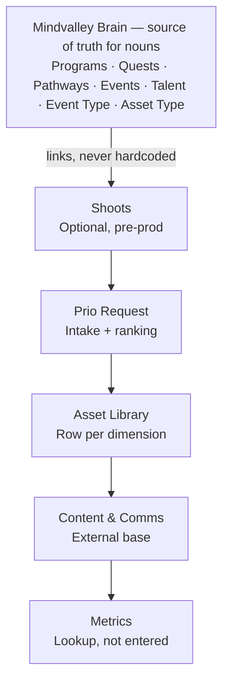
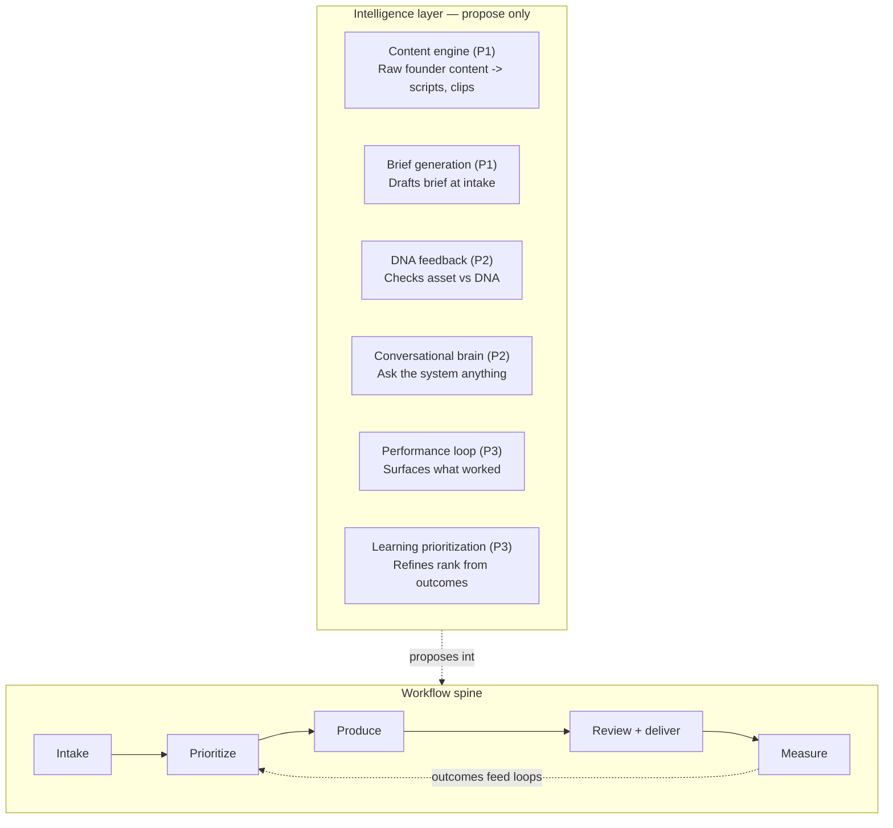
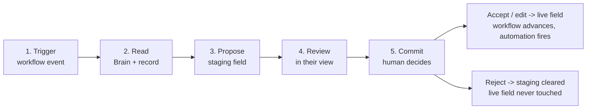

# Mindvalley Content Production & Management System

## Problem

The Social/Ads/Content teams at Mindvalley have merged into one Creative Services team. The primary stakeholder (Vision) cannot see what is being produced, by whom, or how it performs. Work is fragmented across Jira and 4+ Airtable bases (VSSLs, masterclasses, social media, etc.), making it impossible to get a unified view of the content lifecycle.

The concrete pain: there is no single place that answers "who edited this asset, where does it live, and how did it perform?" — the three questions every stakeholder and manager needs answered daily.

> **Imported note:** This tool is a Blinkwork tool for the merged Creative Services team. Airtable remains the ops layer the team maintains by hand (taxonomy, Brain links, asset/event types). The app's own system of record is Postgres, mirrored from Airtable.

## Vision

One full-lifecycle system — intake → prioritization → production → approval → publish → performance — surfaced inside Blinkwork. Replaces the fragmented Jira + 4+ Airtable bases with a single source of truth.

The differentiator: every asset is linked to its live performance metrics (ROAS, CTR, views) from Clarisights/Amplitude/Ahrefs. No other internal tool answers "who edited this AND how did it perform" in one place.

> **Imported note (architecture):**
> ```
> Airtable (ops layer) → Postgres (app system of record) → Next.js app (this repo)
> ```
> Postgres mirror rationale: Airtable API capped at ~5 req/sec, tables already exceed 10,000 records. App needs sub-second queries and full-lifecycle state Airtable can't model cleanly.

**Data spine — what links to what** (`Context/MoreContext/CLAUDE.md` §4). Brain is the source of truth for the *nouns* it already owns (Programs/Quests/Pathways/Events/Talent/Event Type/Asset Type) — fields link to Brain, never hardcode them. Flow: **Shoots (optional) → Prio Request → Asset Library (row per dimension) → Content & Comms → Metrics (lookup).**



Success is measured against end-to-end throughput (the north-star) and manager efficiency — see the Success Criteria section.

> **Direction ratified (Films × Vishen meeting, 26 Jun 2026 — `Context/MoreContext/CLAUDE.md`):** Vishen endorsed the "high-octane / AI-first" direction and the eventual **Blinkwork-app-on-Brain** end state (Brain becomes system of record for the *nouns*; Airtable becomes a connector). That is the **migration target**, not the Phase-1 architecture. The Phase-1 build remains the **HYBRID Postgres model** described here and in the root `CLAUDE.md` (the workflow surfaces are valid under either architecture). The one roadmap shift that *is* immediate: **AI moves into Phase 1** (see Boundaries).

### The request lifecycle (the spine)

Every request travels one path: **Intake → Prioritize → Produce → Review + deliver → Measure → (loops back).**

```mermaid
flowchart LR
  A["Requestor submits<br/>intake form"] --> B["Prio request ranked<br/>Algorithm, no manual SLA"]
  B --> C["Asset Library rows<br/>One per dimension, auto"]
  C --> D["Editor pulls next<br/>Top of ranked queue"]
  D --> E["Production<br/>Guided by linked DNA"]
  E --> F["Review &amp; approval<br/>Feedback link, status"]
  F -->|rework| E
  F --> G["Delivery<br/>Output link, stakeholder"]
  G --> H["Performance lookup<br/>From Content &amp; Comms"]
```



Key behaviours new since the original spec (`Context/MoreContext/CLAUDE.md` §3):
- **Prioritize** replaces manual SLA tracking with an algorithmic score; editors pull the top of the ranked queue rather than being assigned.
- **Asset Library** auto-creates **one row per required dimension** (not one row per asset), driven off the Asset Type. The trigger is a specific Ticket Status — *still to be confirmed* (see Open Questions).
- **Measure** does not capture metrics by hand. They are **looked up** from an external Content & Comms base via a shared matching key — *still to be wired* (see Open Questions).

PNG renders of all diagrams live in `Context/MoreContext/diagrams/` (`01-request-lifecycle.png`, `02-data-spine.png`, `03-to-be-state.png`, `04-propose-commit-handoff.png`).

## Users

**Editor/Designer** — manages a personal queue of assigned tickets. Pulls the next item, updates ticket_status, attaches raw/final assets, links the distribution URL. Context: they work in Blinkwork daily; they care about knowing exactly what to work on next, in what order, without ambiguity.

**Manager** — owns the prioritization board. Drags to reorder queue_rank, assigns/reassigns tickets, sets prio_status, approves work, monitors team capacity. Context: spends ~5 min/day confirming algorithmic ranking + handling exceptions (capacity, staff leave).

**Stakeholder/Agency (read-only)** — Vision and external ad agencies. Views pre-prod → post-prod status, output location, distribution link, and performance metrics. Context: they do NOT have paid seats; access must be free and unlimited. This solves Vision's core frustration of not knowing "who edited this / how did it perform."

[UNRESOLVED] Who is explicitly NOT a target user? Are there other internal roles (e.g. finance, legal, HR) who might request access but should be kept out? What's the access control model for Blinkwork SSO mapping to these three roles?

## Core Capabilities

**1. Intake Form (conditional logic)**
User selects Event Type → Asset Type list filters to those linked to the chosen Event Type → Team Lead and Preferred Editor auto-fill as read-only lookups → Dimensions auto-suggest → remaining fields: Title, Creative Brief, CTA, Positioning, Audience (cold/warm), Due Date. Priority and Assignee are NOT on the form — handled by backend.

Two form variants exist (Ads Creative, Pathway Organic) in Titus's Video Base. [VERIFY both against live base appDZnMnJGehbSOo5.]

**2. Prioritization Queue**
Score = a function of **urgency × complexity**, weighted by **Event Type** + **Asset Type**, plus a **strategic-value input** (Vishen-controlled, added after the 26 Jun meeting — a founder-priority signal). Missing tags → inaccurate scores, so taxonomy is enforced at intake. Output is a ranked queue; editors pull the next item, no SLA tracking. Phase 1 is manual-assisted: managers see algorithmic ranking and spend ~5 min/day confirming order + handling reassignments. Manual re-rank stays the override — automation is an assist, not the authority. Auto-assignment covers only the ~20–30% of unambiguous cases. Vishen sign-off on the final weighting (incl. strategic value) is still open.

**3. Lifecycle State Machine**
```
Requested → Prioritized → Assigned → In Production → In Review
          → Approved → Published → Performance Tracked
```
Every transition writes a ticket_events row (actor, from_state, to_state, note). At the Produce stage, the **Asset Library auto-creates one row per required dimension** (driven off the Asset Type), so production tracks one logical asset per dimension rather than scattered files. The triggering Ticket Status is TBD (see Open Questions).

**4. Three Role-Based Views**
- Editor/Designer: personal queue (next-up first), pull item, update ticket_status, attach assets, link distribution URL
- Manager: prioritization board (drag-to-reorder queue_rank), assign/reassign, set prio_status, approve, capacity overview
- Stakeholder/Agency: read-only — pre-prod → post-prod status, output location, distribution link, performance

Mandated standard: first five columns of every list view = **Title, Priority, Assigned, Ticket Status, Priority Status.**

**5. Airtable Sync**
Reference data (employees, dimensions, event_types, asset_types, dna): one-way Airtable → Postgres via webhook + nightly reconcile. Transactional data (tickets, assets, approvals, shoots): two-way, app is primary, push back to Airtable. Batch ≤10 records/request, exponential backoff on 429.

[UNRESOLVED] Step-by-step flows for each capability need validation against live Airtable data. Several field names and enums are marked [VERIFY] in schema.sql and must be reconciled before first sync.

**6. Intelligence Layer (propose-only)**

The system layers **six AI capabilities** above the workflow spine. Five *augment* the workflow; the sixth — the content engine — *originates* assets. All six follow one safety rule, the **propose-commit handoff** (carried verbatim from `Context/MoreContext/CLAUDE.md` §7):

> **read from Brain + the record → propose into a staging field → a human commits.** The AI never writes a live record directly. Downstream automation (Asset Library row creation, queue ranking, notifications) only ever fires off **live** fields, so a bad suggestion sitting in staging cannot move anything until a human promotes it. Implementation under the hybrid model: each AI-touched record gets a staging twin (e.g. a `brief` live column + a `brief_ai_draft` staging column); a button/action promotes staging → live on human action.

| # | Capability | Originates / Augments | Phase | Epic |
|---|------------|-----------------------|-------|------|
| 1 | **Content engine** — raw founder content → candidate request rows / scripts / clips | Originates | **P1** | E8 (resolved) |
| 2 | **Brief generation** — drafts the creative brief at intake from winners + DNA + Brain | Augments (intake) | **P1** | E9 |
| 3 | **DNA feedback** — first-pass check of an asset against its DNA standards | Augments (produce) | P2 | E10 |
| 4 | **Conversational brain** — natural-language Q&A over the records (read-only, no commit) | Augments (all) | P2 | E11 |
| 5 | **Performance loop** — surfaces what worked, correlating asset attributes with metrics | Augments (measure) | P3 | E7 |
| 6 | **Learning prioritization** — proposes score-weight adjustments from observed outcomes | Augments (prioritize) | P3 | E12 |



Where each capability plugs in (`Context/MoreContext/CLAUDE.md` §7):

| Capability | Trigger | Reads | Proposes to | Who commits |
|------------|---------|-------|-------------|-------------|
| Content engine | Raw founder upload | content + Brain | candidate request rows | Human picks which become requests |
| Brief generation | New request row | request + Brain + top performers | `brief_ai_draft` staging | Manager approves |
| DNA feedback | Asset attached | asset + linked DNA | gap-flags field | Editor acts before review |
| Learning prioritization | Fresh outcomes | outcomes + score config | proposed weight changes | Vishen / manager confirms |
| Performance loop | Metrics lookup runs | metrics + asset attributes | insight surface | Surfaced; feeds learning prio |
| Conversational brain | A person asks | records (Brain at migration) | an answer | **No commit — read-only** |

The 50× comes from collapsing *drafting* time, not *deciding* time: brief generation turns a 30-minute brief into a 30-second approve; the content engine turns "watch a 2-hour podcast and find the clips" into "review 15 proposed clips." The human decision stays — it just starts from a draft.

> **Note on capability count:** `Context/intelligence-layer.md` describes *five* capabilities with different numbering; it is **superseded** by `Context/MoreContext/CLAUDE.md`, which adds the content engine as the sixth (originating) capability. The six-capability model above is authoritative.



**7. Taxonomy additions (post 26 Jun)**

Absorbed into the existing Event Type / Asset Type spine, not new primary axes:
- **Social = film.** Social and film are now one unified content entity, biased toward free founder-channel content — handled as Event/Asset Type additions.
- **New category cuts:** distinct **Video**, **Build Process / Document**, and **Social Media Clips** categories.

## Boundaries

**In scope (Phase 1):**
- Intake form with conditional Event→Asset→lookup chain
- Prioritization queue with drag-to-reorder (incl. the strategic-value input)
- Three role views with mandated 5-column header
- Airtable sync (reference data read-only first, then two-way for transactional)
- Free external reviewer access (no paid seat required)
- Version stacking for assets (raw vs final under one logical asset)
- Decision locks: approval stage blocks next state transition
- **AI content engine** (E8 — capability #1; raw founder content → candidate requests/clips) — *pulled into Phase 1* by the 26 Jun "high-octane / 50×" decision
- **AI brief generation** (E9 — capability #2; drafts the brief at intake, propose-only) — *pulled into Phase 1*

**Explicitly deferred to Phase 2+:**
- DNA feedback (capability #3, P2) — asset-vs-DNA first-pass; needs a multimodal pipeline
- Conversational brain (capability #4, P2) — read-only Q&A; full value lands at the Brain migration
- Performance loop (capability #5, P3) + learning prioritization (capability #6, P3) — gated on the Content & Comms matching key
- Frame-accurate video comments (timecode-anchored)
- Full automation depth (beyond ~20–30% auto-assignment)

**Borrowed, not built:**
- Asset library UI patterns (Air)
- Approval routing UI (Ziflow/Frame.io patterns)

**Phase 1 scope fence (do NOT over-build) — from decision-log + context/README:**
- No predictive capacity modeling.
- No auto-rebalancing of tickets across editors.
- No SLA timers — the queue model replaces SLAs by design.
- Auto-assignment covers only the ~20–30% unambiguous cases (e.g. a business unit that always routes to one person, or a `preferred_editor` set on the asset_type). Everything else lands in a manager triage view.

These are Phase 2 candidates *only if* the manual-assisted queue proves insufficient after a real week of use.

> **Sync conflict handling (resolved by the system-of-record rule):** Postgres is primary for transactional data (tickets/assets/approvals/shoots) — the app wins on those, pushing changes back to Airtable. Airtable is primary for reference data (employees/dimensions/event_types/asset_types/dna) — those are read-only in the app and reconcile is upsert-on-`airtable_id`. Failed pushes honor 429 with exponential backoff and retry; provenance via `airtable_id` makes reconcile idempotent.

## Success Criteria

**North-star metric: End-to-end throughput.** The system succeeds if real work flows through the entire lifecycle inside the tool — not in Jira, Slack, or hand-kept Airtable.

- **Ship gate (Phase 1 "done"):** ≥1 real content request completes the Phase 1 lifecycle — Requested → Prioritized → Assigned → In Production → In Review → Approved → **Published** — entirely in-tool, with every transition recorded as a `ticket_events` row and no step tracked outside the system. This mirrors the Air 5-day rollout: prove the loop end-to-end before adding automation depth. (Performance Tracked is the final state but is deferred to Phase 3 with the Performance Loop epic — see Epics E7; it is gated on the Content & Comms matching key.)
- **30-day target:** ≥10 tickets reach Published in-tool. [UNRESOLVED] The exact number (10 is a proposed placeholder) should be set against the team's real weekly request volume.

**Committed operational criterion: Manager efficiency.**

- Managers spend ≤5 min/day confirming queue order (the explicit Hackathon claim — the algorithm gets the order ~80% right so managers only adjust the edges).
- Queue-override rate (manual `queue_rank` changes vs. the algorithm's `priority_score` order) trends down week-over-week as trust in the urgency×complexity scoring grows. A flat-high override rate signals the weights need tuning. [UNRESOLVED] How the ≤5 min/day is instrumented — session time in the prioritization board vs. self-report — is undecided.

**Tracked, but NOT gated** (kept visible so they aren't lost, but not Phase 1 acceptance gates):

- *Adoption / displacement* — % of new content requests originating in the intake form vs. Jira/Slack/ad-hoc.
- *Performance-loop coverage* — % of published assets with ≥1 linked performance metric (ROAS/CTR/views) within ~14 days. This is the "how did it perform" half of Vision's original question; deliberately not gated for Phase 1 but worth watching, since an empty `performance` table means the differentiator never landed. Both P3 learning capabilities (performance loop + learning prioritization) cannot function until metrics flow back — the single unlock is the **Content & Comms base URL + shared matching key** (see Open Questions).
- *Stakeholder engagement* — Vision/agencies are weekly-active in the read-only view, and "who edited this / what's the status" pings to the team drop (baseline before launch).

## Open Questions

**Open items with owners (from `Context/MoreContext/CLAUDE.md` §9):**

| Item | Owner | Gates |
|------|-------|-------|
| Content & Comms base URL + shared matching key | Rhythm / Matt | **Phase 3** (both learning capabilities) |
| Confirm the Ticket Status that triggers Asset Library auto-creation | Rhythm | Produce stage |
| Strategic-value weighting in the score | Vishen | Prioritize stage |
| Confirm Brain table names (Programs, Events, Talent) + the stable link key | Garrett | Phase 2 syncs |
| Do metrics aggregate across placements? | Rhythm / Moniek | Measure stage |
| Two-way sync of Video + Design DNA bases | Matt | DNA feedback (E10) |
| Vishen sign-off on prioritization logic | Vishen | Prioritize stage |
| Build out the Asset Library table | Rhythm / Moniek | Produce stage |
| Loom links + Slack channel name in launch comms | Rhythm | Launch |

**Architecture fork — DECIDED: HYBRID (2026-06-25).** Build the workflow surfaces (intake, queue, role views — valid under either architecture) now in this standalone repo; migrate the *nouns* to brain nodes + an app manifest later, referencing the BlinkWork monorepo (`github.com/mindvalley-ai/BlinkWork`, INTERNAL, accessible via `gh`). Only workflow state (tickets/queue/approvals) stays app-owned permanently. The standalone Postgres model (E1) holds for now and is reframed — not discarded — at migration. `context/productization.md` is the migration target spec.

Still open under the hybrid:
- **Intelligence layer** (`context/intelligence-layer.md`): 5 propose-only capabilities — a likely new epic (E8), build order 1→2 first. Largely free under the Blinkwork-app fork, more work under standalone.
- **UI mockups** (`context/mockups/`): the agreed visual target for E3/E5 surfaces — rebuild in `@mindvalley-ai-advanced/ui` (shadcn/CVA), do not restyle the HTML.

**Decisions explicitly NOT yet settled (from decision-log — do not guess):**

- **Event-tier ranking** for the urgency score — the exact ordering (notes suggest Mastery / Summit / MBU high > Academy > States lower; Social/Pathway depends on campaign window). Owner: **Moniek**.
- **Performance-metrics home** — whether metrics live on the Prio table or the Asset Library. Currently modeled library-side in `schema.sql`; **CONFIRM** with team.
- **Brain table names + the stable key to link on** (Programs/Quests/Pathways/Events/Talent). Owner: **team**. Blocks `event_types.brain_program_id` sync.
- **Status enum values** — `prio_status`, `ticket_status`, and `shoots.status`. Resolved by running `context/export-airtable-schema.js` against the live bases.

**Blinkwork embedding contract (the human must provide — from context/README):**

- Auth/SSO model: how the app receives a verified identity and maps it to `employees`; iframe vs. module embedding; shared component library; deploy pipeline; whether Postgres is shared infra or fresh.

**[VERIFY] fields to reconcile against live Airtable before first sync** (run the schema export, then update `schema.sql`):

- `employees.team` / `employees.division` values · single-vs-multi link relationships · select-option values throughout.
- Two form variants (Ads Creative, Pathway Organic) and the "Social Media Promotion" vs literal "Pathway" event-type distinction — against `appDZnMnJGehbSOo5`.

**Migration:**

- Jira export CSV + Jira→taxonomy field mapping (owner: Matthew Wong for post-Jun-24 tickets; historical backfill: Matt).

## People / RACI

From `Context/MoreContext/CLAUDE.md` §10.

| Person | Role |
|--------|------|
| Rhythm Malhotra | System owner, build lead |
| Moniek van Waaijenburg | Co-architect; comms to Pathway Organic + Ads stakeholders |
| Titus Thana Raj | Team lead, video; Ads Creative + Pathway Organic |
| Matthew Wong (Matt) | Jira migration / cutover / ticket migration |
| Matt (separate) | Historical data backfill |
| Chee Ling / Khairul (Kyro) | Airtable taxonomy maintainers; Khairul owns Event Type tagging |
| Garrett | Head of Content; owns Event Types + Production Types in Brain |
| Vishen | Senior stakeholder; prioritization logic + sign-off; strategic-value input |
| Vidura | Primary stakeholder for Pathway Organic IG channels |
| Jawan, Millie P., Paul A., Ziga | Editors and designers |

## Epics

The workflow spine is six epics (E1–E6). The intelligence layer adds E8–E12; E7 (Performance Loop) is the measure-stage capability. Each has a child PRD under `content-production-management/`. Per the 26 Jun decision, the two **P1** AI epics (E8 content engine, E9 brief generation) are now part of the Phase-1 build.

| # | Epic | Purpose | Depends on | Phase |
|---|------|---------|-----------|-------|
| E1 | [Foundation & Data Layer](content-production-management/foundation-data-layer.md) | Translate `schema.sql` → Prisma, migrate, and scaffold auth mapped to `employees`. | — | 1 |
| E2 | [Reference Sync (inbound)](content-production-management/reference-sync.md) | One-way Airtable→Postgres for employees/dimensions/event_types/asset_types/dna; run the schema export and reconcile every `[VERIFY]`. | E1 | 1 |
| E3 | [Intake](content-production-management/intake.md) | The conditional Event→Asset→lookup intake form with enforced required taxonomy. | E1, E2 | 1 |
| E4 | [Prioritization & Queue](content-production-management/prioritization-queue.md) | `urgency×complexity` (+ strategic value) scoring, drag-to-reorder `queue_rank`, and ~20–30% auto-assignment. | E3 | 1 |
| E5 | [Lifecycle, Views & Approvals](content-production-management/lifecycle-views-approvals.md) | State machine + `ticket_events` audit, the three role views (5-column header), approvals/decision-locks, asset version-stacking + Asset-Library-per-dimension, distribution link. | E3 (E4 parallel) | 1 |
| E6 | [Two-Way Sync (outbound)](content-production-management/two-way-sync.md) | Push tickets/assets back to Airtable — batched ≤10, 429 backoff. Built last, after reads are stable. | E5 | 1 |
| E7 | [Performance Loop](content-production-management/performance-loop.md) | Look up `performance` from Content & Comms, attach to published assets, surface in the stakeholder view + propose-only insights. The differentiator. | E5 | **3** |
| E8 | [AI Content Clipping Engine](content-production-management/content-clipping-engine.md) | Capability #1 (originates). Raw founder content → candidate request rows / scripts / clips. **Resolved.** | E3 | **1** |
| E9 | [Brief Generation](content-production-management/brief-generation.md) | Capability #2 (augments intake). Draft the brief from winners + DNA + Brain → `brief_ai_draft` staging → human approves. | E3, E7-insights | **1** |
| E10 | [DNA Feedback](content-production-management/dna-feedback.md) | Capability #3 (augments produce). First-pass asset-vs-DNA check → gap flags. | E5, multimodal pipeline | 2 |
| E11 | [Conversational Brain](content-production-management/conversational-brain.md) | Capability #4 (read-only). Natural-language Q&A over records; no commit step. | E1, E5 | 2 |
| E12 | [Learning Prioritization](content-production-management/learning-prioritization.md) | Capability #6 (augments prioritize). Propose score-weight changes from outcomes; propose-only. | E4, E7 | 3 |

**Dependency order (Phase 1):** E1 → E2 → E3 → {E4 ∥ E5 ∥ E8} → E6; E9 follows E3 (uses E7-insights when available, degrades gracefully without). E10/E11 in Phase 2; E7 + E12 in Phase 3 (gated on the Content & Comms key).
